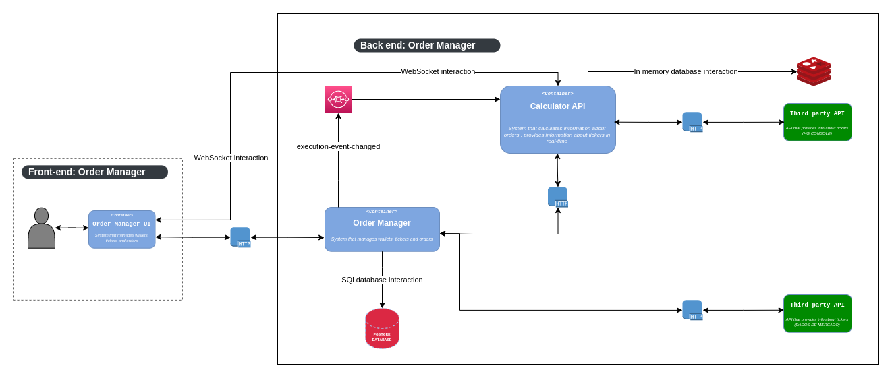

## Microservice: Managing investments( Front-end ).

The application is an investment manager, where the user can invest with security and monitor investments easily
This application is a part of an Undergraduate Thesis.

## :warning: Warning

- It's not the intention of this Undergraduate Thesis create a commercial product but something didactic
  to put into practice what was learned in the Graduation.

## :wrench: Architecture flowchart

### Api that is part of this project

- [investiment-manager](https://github.com/joseMarciano/investments-manager)

